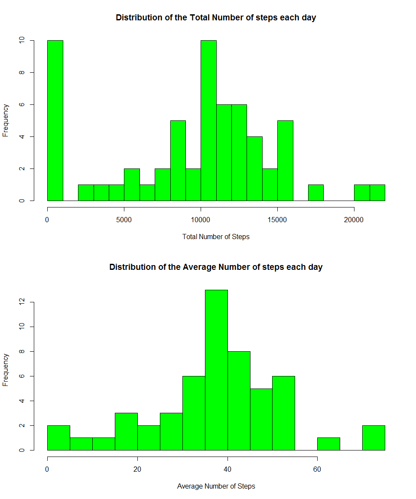
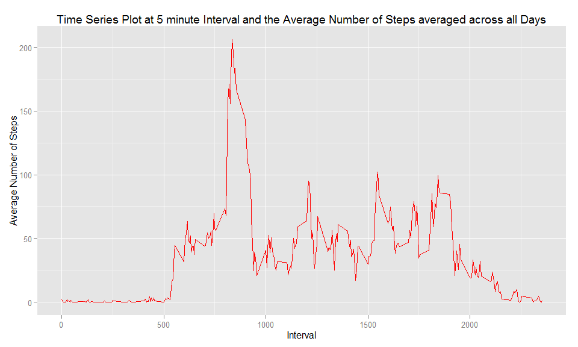
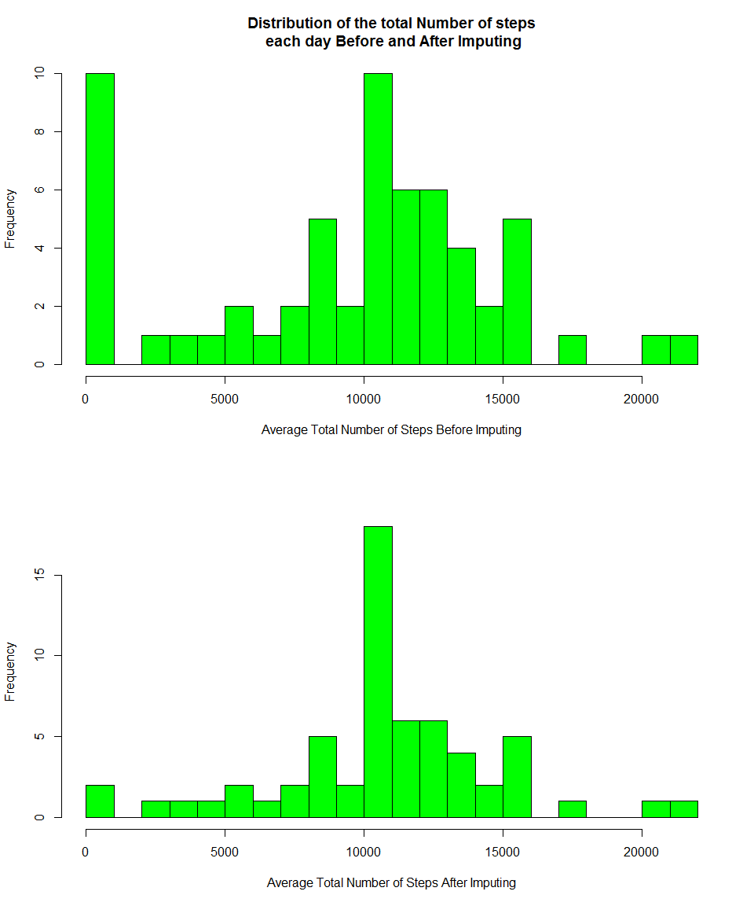
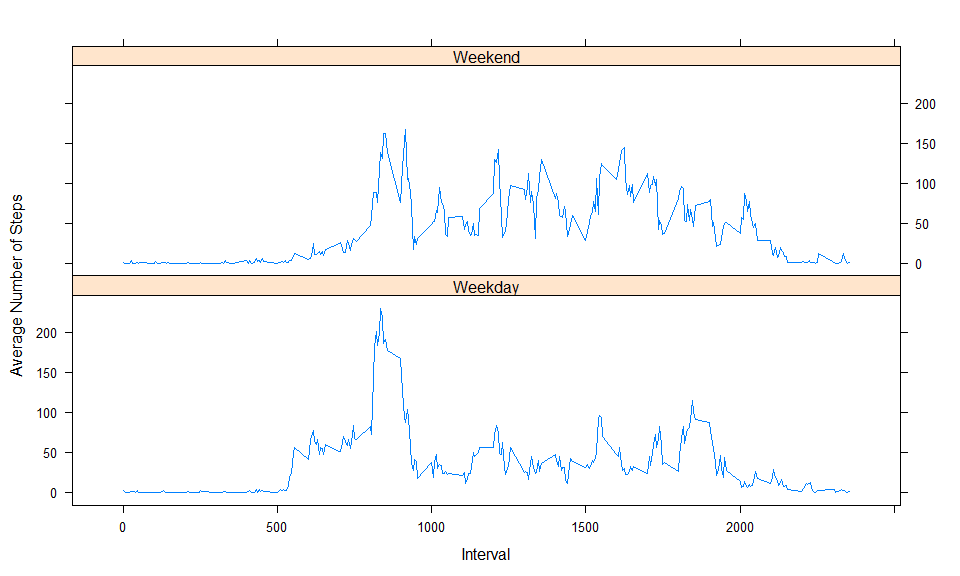
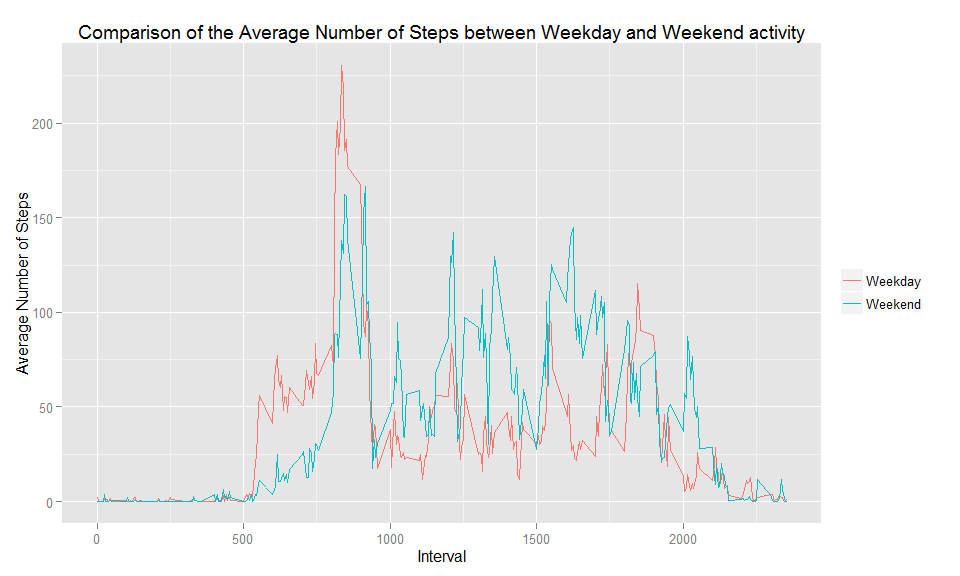

# Reproducuble Research - Peer Assessment 1
Brendan Madigan  
February 12, 2015  

## Introduction

It is now possible to collect a large amount of data about personal movement using activity monitoring devices such as a Fitbit, Nike Fuelband, or Jawbone Up. These types of devices are part of the “quantified self” movement – a group of enthusiasts who take measurements about themselves regularly to improve their health, to find patterns in their behavior, or because they are tech geeks. But these data remain under-utilized both because the raw data are hard to obtain and there is a lack of statistical methods and software for processing and interpreting the data.

This assignment makes use of data from a personal activity monitoring device. This device collects data at 5 minute intervals through out the day. The data consists of two months of data from an anonymous individual collected during the months of October and November, 2012 and include the number of steps taken in 5 minute intervals each day.

## Data  
The data for this assignment can be downloaded from the course web site:  

*  Dataset: Activity monitoring data [52K]
*  URL:     https://d396qusza40orc.cloudfront.net/repdata%2Fdata%2Factivity.zip

The variables included in this dataset are:

*  steps: Number of steps taking in a 5-minute interval (missing values are coded as NA)
*  date: The date on which the measurement was taken in YYYY-MM-DD format
*  interval: Identifier for the 5-minute interval in which measurement was taken

The dataset is stored in a comma-separated-value (CSV) file and there are a total of 17,568 observations in this dataset.  


## Load  and prepare the data
1. Set the working directory
2. Specify the URL from where the data will be downloaded
3. Download the .zipp file
4. Unzip the data file
5. Convert the dates to the date class
6. Convert time interval to a factor
7. Extract levels at 5 minute intervals
8. Summarise the total and average number of steps


```r
#   setwd("C:/Users/Brendan/DataScienceCourse/Reproducible Research")
    URL_for_data      <-  "http://d396qusza40orc.cloudfront.net/repdata%2Fdata%2Factivity.zip"
    download.file(URL_for_data, destfile="activity.zip")
    activity          <- read.csv(unz("repdata_data_activity.zip", "activity.csv"))
    ActivityClone      <- activity
    activity$Date     <- as.Date(activity$date, "%Y-%m-%d")
    activity$interval <- as.factor(activity$interval)
    Interval_Levels   <- levels(activity$interval)
```

## Total and Average number of steps taken each day
1. tapply is used to determine the total, mean and median number of steps each day
2. Show the summary of the actuviy data
3. Produce a histogram of the total number of steps
4. Produce a histogram of the average number of steps

```r
    Step_Total    <- tapply(activity$steps, activity$date, sum, na.rm=T)
    Step_Average  <- tapply(activity$steps, activity$date, mean, na.rm=T)
    summary(Step_Total)
```

```
##    Min. 1st Qu.  Median    Mean 3rd Qu.    Max. 
##       0    6778   10400    9354   12810   21190
```

```r
    par(mfrow=c(2,1))
    hist(Step_Total, breaks=20, col="green", main="Distribution of the Total Number of steps each day", xlab="Total Number of Steps")

    hist(as.vector(Step_Average), breaks=20, col="green", main="Distribution of the Average Number of steps each day", xlab="Average Number of Steps")
```

 

## Daily activity pattern
### Determine the average number of steps and group by time intereval

1. Make a time series plot (i.e. type = "l") of the 5-minute interval (x-axis) and the average number of steps taken, averaged across all days (y-axis)
2. Which 5-minute interval, on average across all the days in the dataset, contains the maximum number of steps?


```r
    Steps          =  tapply(activity$steps, activity$interval, mean, na.rm=T)
    Interval       <- as.numeric(Interval_Levels)
    DailyActivity  <- data.frame(Steps, Interval)
```

```r
    library(ggplot2)
    PlotData <- ggplot(DailyActivity, aes(Interval, Steps))
    PlotData + geom_line(colour="red") +ggtitle("Time Series Plot at 5 minute Interval and the Average Number of Steps averaged across all Days") + ylab("Average Number of Steps")
```

 

## Imputing missing values
Note that there are a number of days/intervals where there are missing values (coded as NA). The presence of missing days may introduce bias into some calculations or summaries of the data.

1. Calculate and report the total number of missing values in the dataset (i.e. the total number of rows with NAs)
2. Devise a strategy for filling in all of the missing values in the dataset. The strategy does not need to be sophisticated. For example, you could use the mean/median for that day, or the mean for that 5-minute interval, etc.
* Use mice (multivariate imputation chains equation) to impute the NA values
* Information on the mice and Amelia packages can be found on the web:
* mice:     http://cran.r-project.org/web/packages/mice/index.html
3. Create a new dataset that is equal to the original dataset but with the missing data filled in.
4. Make a histogram of the total number of steps taken each day and Calculate and report the mean and median total number of steps taken per day. Do these values differ from the estimates from the first part of the assignment? What is the impact of imputing missing data on the estimates of the total daily number of steps ?


```r
    missing     <- is.na(activity)
    (n.missing  <- sum(missing))
```

```
## [1] 2304
```

```r
    library(mice)
```

```
## Warning: package 'mice' was built under R version 3.1.2
```

```
## Loading required package: Rcpp
## Loading required package: lattice
## mice 2.22 2014-06-10
```

```r
    imputedData <- complete(mice(activity))
```

```
## 
##  iter imp variable
##   1   1  steps
##   1   2  steps
##   1   3  steps
##   1   4  steps
##   1   5  steps
##   2   1  steps
##   2   2  steps
##   2   3  steps
##   2   4  steps
##   2   5  steps
##   3   1  steps
##   3   2  steps
##   3   3  steps
##   3   4  steps
##   3   5  steps
##   4   1  steps
##   4   2  steps
##   4   3  steps
##   4   4  steps
##   4   5  steps
##   5   1  steps
##   5   2  steps
##   5   3  steps
##   5   4  steps
##   5   5  steps
```

```r
    ActivityClone$steps[is.na(ActivityClone$steps)] <- tapply(ActivityClone$steps,        ActivityClone$interval, mean, na.rm = TRUE)
    totStepsImp <- tapply(ActivityClone$steps, ActivityClone$date, sum)

    summary(Step_Total)
```

```
##    Min. 1st Qu.  Median    Mean 3rd Qu.    Max. 
##       0    6778   10400    9354   12810   21190
```

```r
    summary(totStepsImp)
```

```
##    Min. 1st Qu.  Median    Mean 3rd Qu.    Max. 
##      41    9819   10770   10770   12810   21190
```
### Impacts of Imputation
Imputation takes the minimum value up to 41, the first quartile value has been increased, which is to be expected as the missing values have been populated. The values of median and mean have both increased. Otherwise there doesn't seem to be a significant difference.

```r
    par(mfrow=c(2,1))

    hist(Step_Total, col="green", xlab="Average Total Number of Steps Before Imputing", main="", breaks=20)
    title("Distribution of the total Number of steps\n each day Before and After Imputing")
    hist(totStepsImp, col="green", main="", xlab="Average Total Number of Steps After Imputing", breaks=20)
```

 

## Are there differences in activity patterns between weekdays and weekends?
1. Extract the Weekday values
2. Extract the Wekend values

```r
    ActivityClone$Days <- weekdays(as.Date(as.character(ActivityClone$date)))
    TypeWE         <- ActivityClone$Days=="Saturday" | ActivityClone$Days=="Sunday"
    ActivityClone$Days[TypeWE]    = "Weekend"
    ActivityClone$Days[!TypeWE]   = "Weekday"

    ActivityCloneWD <- ActivityClone[ActivityClone$Days == "Weekday",]
    ActivityCloneWE <- ActivityClone[ActivityClone$Days == "Weekend",]
    IntervalWD     <- as.numeric(levels(as.factor(ActivityCloneWD$interval)))
    IntervalWE     <- as.numeric(levels(as.factor(ActivityCloneWE$interval)))
    WeekdayAverage <- tapply(ActivityCloneWD$steps, ActivityCloneWD$interval, mean)
    WeekendAverage <- tapply(ActivityCloneWE$steps, ActivityCloneWE$interval, mean)
    WeekDays       <- data.frame(WeekdayAverage, IntervalWD)
    WeekEnds       <- data.frame(WeekendAverage, IntervalWE)

    ActivityClone$Days       <- as.factor(ActivityClone$Days)
    ActivityClone$interval   <- factor(ActivityClone$interval)
```
## Plot Weekday activity followed by the weekend plot


```r
    WeekDays$wDays     <- rep("Weekday", nrow(WeekDays))
    WeekEnds$wDays     <- rep("Weekend", nrow(WeekDays))

    colnames(WeekDays) <- c("Steps", "Interval", "wDays")
    colnames(WeekEnds) <- c("Steps", "Interval", "wDays")

    BindData                 <- rbind(WeekDays, WeekEnds)
    BindData$wDays           <- factor(BindData$wDays)

    library(lattice)
    
    xyplot(Steps ~ Interval | wDays, data=df, type='l', layout=c(1,2), ylab="Average Number of Steps")
```

 
### Plot he weekend data against the weekdays data
Create a panel plot containing a time series plot (i.e. type = "l") of the 5 minute interval (x-axis) and the average number of steps taken, averaged across all weekday days or weekend days (y-axis).


```r
g <- ggplot(df, aes(Interval, Steps, fill=wDays, colour=wDays))
g + geom_line() + labs(colour="") + ggtitle("Comparison of the Average Number of Steps between Weekday and Weekend activity") + ylab("Average Number of Steps")
```

 
